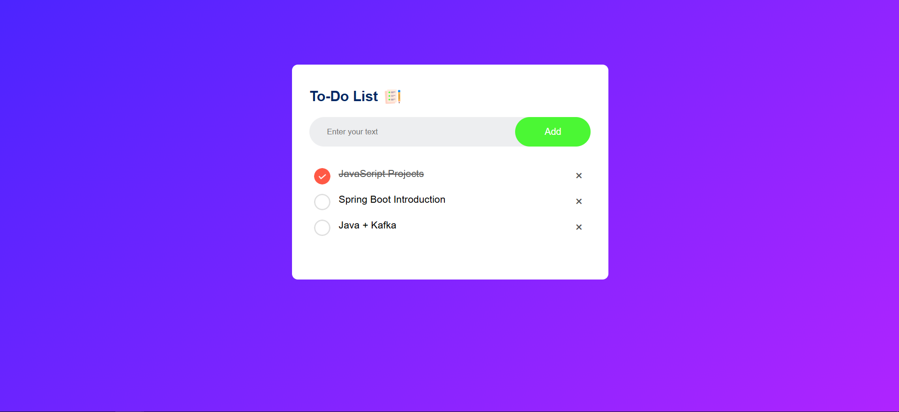
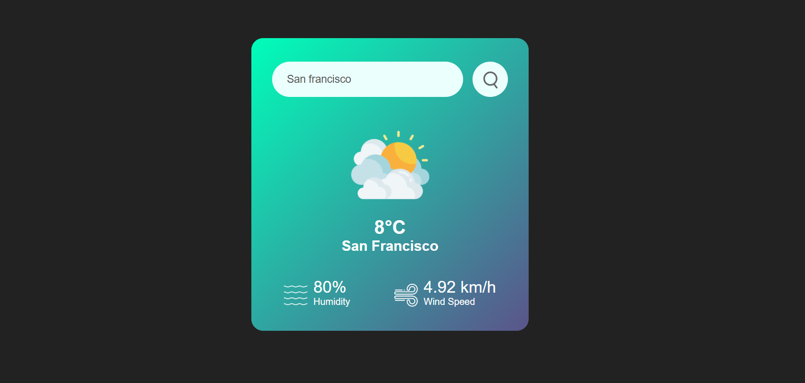
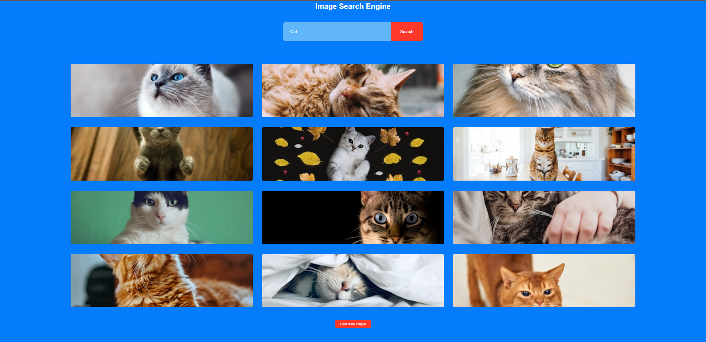
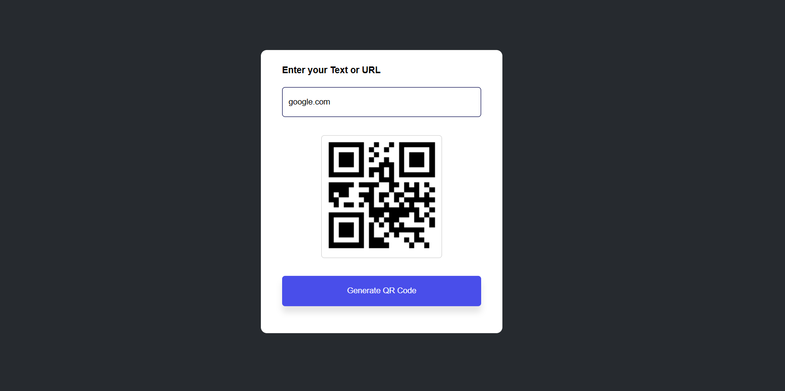
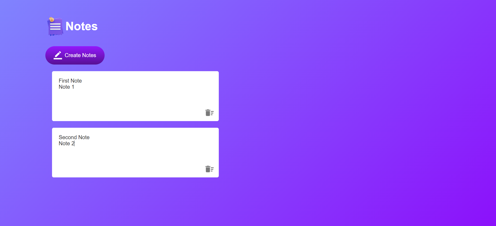
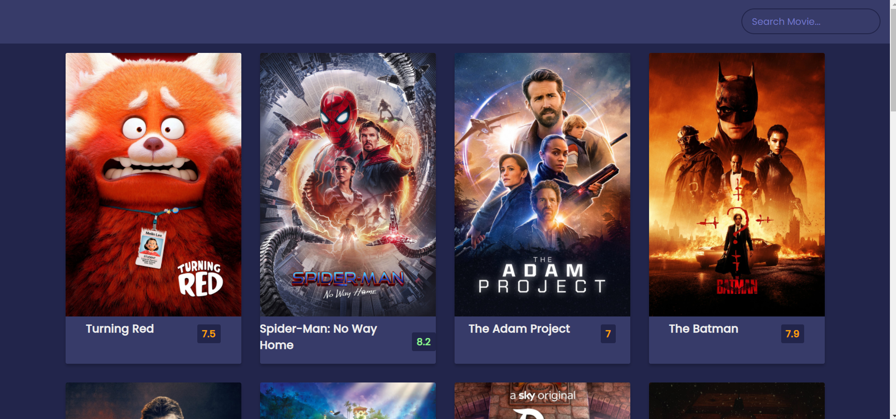
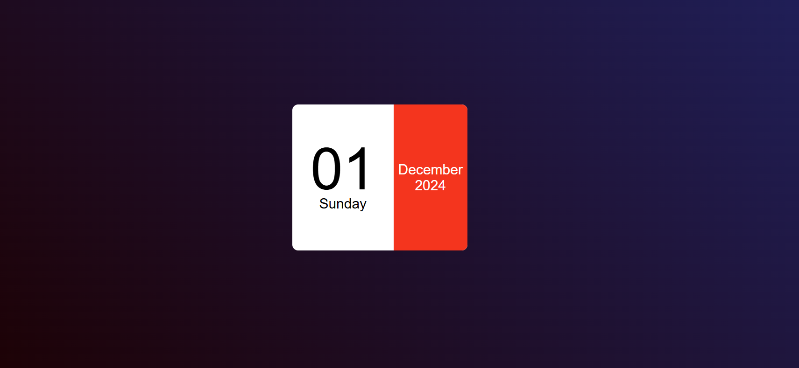
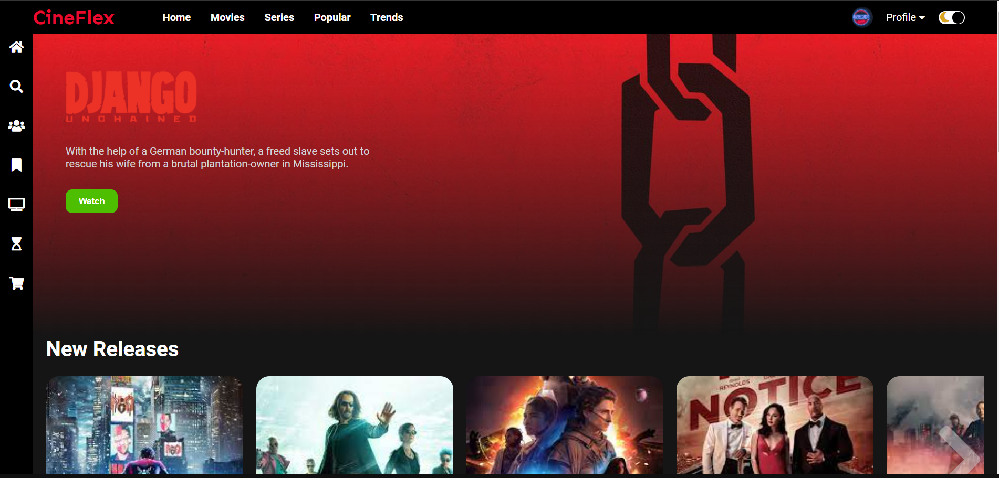
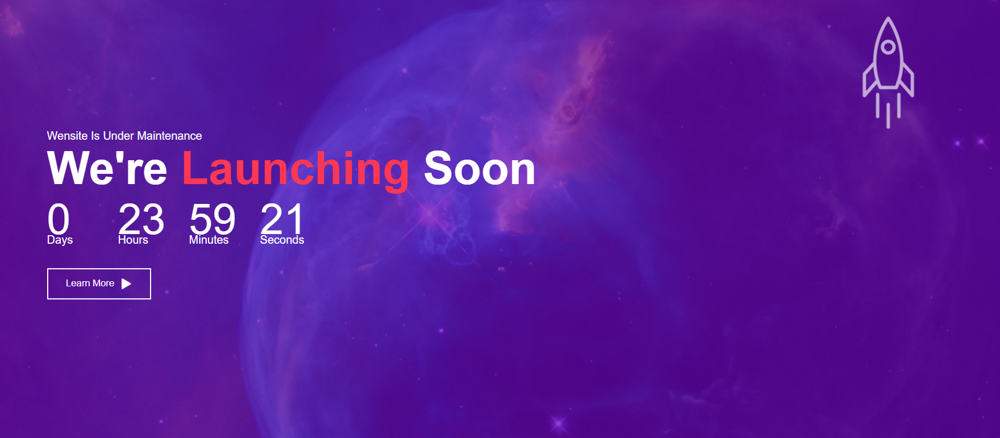

# JS_Projects

## Beginner level JavaScript projects

### [To-Do List App](https://sumeetgedam.github.io/JS_Projects/Todo_list/)

### [Weather App](https://sumeetgedam.github.io/JS_Projects/Weather_app/)

### [Image Search Engine](https://sumeetgedam.github.io/JS_Projects/Image_search_engine/)

### [QR Code Generator](https://sumeetgedam.github.io/JS_Projects/QR_code_generator/)

### [Notes App](https://sumeetgedam.github.io/JS_Projects/Notes_app/)

### [Movie Info app](https://sumeetgedam.github.io/JS_Projects/Movie_info_app/)

### [Mini Calendar](https://sumeetgedam.github.io/JS_Projects/Mini_calendar/)

### [Static Movie Website](https://sumeetgedam.github.io/JS_Projects/Movie_website/)
  

  
### [Coming Soon](https://sumeetgedam.github.io/JS_Projects/Coming_soon/)

